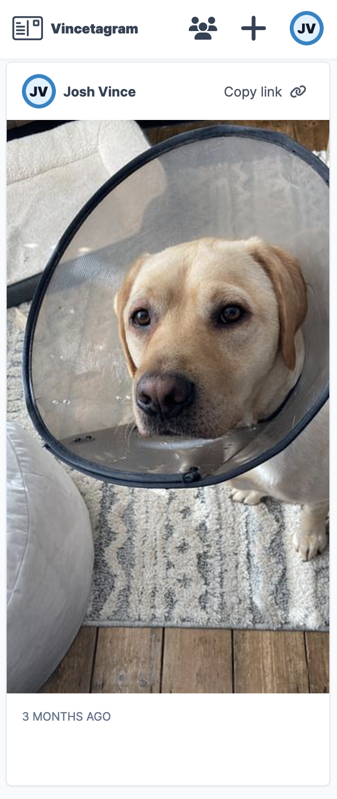

# Vincetagram
Vincetagram is a private image-based social network designed for me and my family to store and share images to people we know. The app is also sometimes known as "Postcard".

The app has very basic image sharing functionality - admin users can upload posts containing images or videos, these posts can be viewed in a feed (if you have been invited) or using a direct link to the post.

Auth happens by a magic email link, there are no passwords at all. Admin users are the only users who can invite someone, and then that person will receive an email to sign in. If they get logged out, they can generate another link again. The tokens are single use.

The emails are sent via Amazon SES. Credentials are included on the production box.

# Development
This is a rails app. You need to have Ruby and PSQL installed locally for it to work. Check the `.ruby-version` file for specific version information.

Although we run the production application in docker, I haven't set up the development environment to run in docker.

## Setup
- Check out `.env.example` for the variables you'll need in your environment
- `bin/bundle install` to install deps
- `bin/rake db:prepare` to create and migrate the database
- `bin/dev` to start the application on port 3000

# Production
This is currently deployed on my home server using docker. You can see pretty much exactly how this works in the Dockerfile and docker-compose.yml files. Essentially, we manage the environment from an .env file on the box, using docker to expose volumes to interact with the database and the wider server (as assets are copied from our application to the archive containing my media.)

To see more, you'd have to visit my [config repo](https://github.com/joshvince/vince-family-archive-config) which is private.

## Images and Videos
When images are uploaded, the Rails server stores them as an ActiveStorage blob.

These blobs are stored in a volume which is defined in the BLOB_STORAGE_ROOT environment variable drawn from the .env file on the outer system which will run docker. The docker-compose.yml file binds the directory (in the container) in the variable to a volume in the server (outside of the container).

This means that blobs will be stored outside the server, and therefore will not be wiped with each deploy. There's no need to gitignore anything on production, although the `tmp/active_storage_blobs` directory is gitignored as this is the default location to save blobs to in development (controlled by the .env file)

### Syncing the images to the archive
Images themselves are sync'd when they are saved from the blob directory to the main archive on the server. The archive is where I store all of our important documents and media. Vincetagram is the main way we add new media files to the archive.

The docker-compose.yml file binds the directory (in the container) in the FILE_STORAGE_ROOT environment variable to a volume in the server (outside of the container). This is where the big archive of photos is.

When a post is created, the media file associated is automatically synced into the archive - it's also stored in the rails ActiveStorage location, meaning eventually I will run out of space...

Inside `Post.rb` there's a method to sync the uploaded image to the directory. It builds a directory based on today's date and then writes to a file in the volume (which is outside the docker container).

The rails app does not destroy or change anything in that directory, it only writes to it.
The Rails app runs using the `rails` user, which has been given write permissions on the outer directory manually from inside the server.

# Deploying
1. SSH into the server
2. `cd /postcard` (where this repo lives)
3. `git pull`
4. `docker compose build && docker compose up -d`

For more detailed deployment information, check out the guide in the server config [repo](https://github.com/joshvince/vince-family-archive-config)

# Congratulations
You made it to the end. Here's a picture of the app

